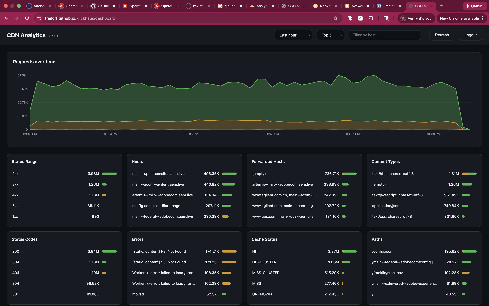

# Klickhaus - CDN Analytics Dashboard

A real-time analytics dashboard for CDN log analysis, built with ClickHouse and vanilla JavaScript.




## Features

- **Real-time request monitoring** - Stacked area chart showing requests over time, color-coded by status (2xx/3xx green, 4xx yellow, 5xx red)
- **Multi-dimensional breakdowns** - Analyze traffic by:
  - Status codes and ranges
  - Hosts and forwarded hosts
  - Content types
  - Cache status (HIT, MISS, etc.)
  - Paths and referers
  - User agents and IP addresses
  - Request types and backend types
  - HTTP methods and datacenters
  - ASN (Autonomous System Numbers)
- **Interactive filtering** - Click to filter or exclude any dimension value
- **Copy to spreadsheet** - Copy any facet's data as TSV with one click (copy button) for analysis in Excel/Sheets
- **Flexible time ranges** - Last hour, 12 hours, 24 hours, or 7 days
- **Dark mode support** - Automatic theme based on system preference
- **Query caching** - Intelligent cache TTLs based on time range

## Architecture

The dashboard queries a ClickHouse database containing unified CDN logs from Cloudflare and Fastly:

```
Cloudflare Logpush ──► cloudflare_http_requests (1-day TTL)
                              │
                    cloudflare_http_ingestion (MV)
                              │
                              ▼
                     cdn_requests_combined (2-week TTL)
                              ▲
                    fastly_ingestion (MV)
                              │
Fastly HTTP Logging ─► fastly_logs_incoming2 (1-day TTL)
```

Both CDN sources use direct HTTP logging to ClickHouse with async inserts for high-throughput ingestion.

## Usage

### General Dashboard

1. Open `dashboard.html` in a browser (or visit [klickhaus.aemstatus.net](https://klickhaus.aemstatus.net/), fallback: [maisonclic.aemstatus.net](https://maisonclic.aemstatus.net/))
2. Log in with your ClickHouse credentials
3. Use the time range selector and host filter to narrow down results
4. Click on any breakdown value to filter, or use the "Exclude" button to exclude it

### Delivery Dashboard

A focused dashboard for core delivery monitoring is available at `delivery.html`. It excludes backend, admin, RUM, and docs services (15 hosts) via hard-coded SQL filters, showing only user-facing delivery traffic. All main dashboard facets are available; a curated subset is shown by default. See `js/delivery-main.js` for the exclusion list.

### Copy Facet Data

Click the "copy" button on any facet header to copy its data as TSV. Paste directly into Excel, Google Sheets, or Numbers.

## URL Parameters

The dashboard state can be controlled via URL parameters for bookmarking and sharing:

| Parameter | Description | Example |
|-----------|-------------|---------|
| `t` | Time range: `15m`, `1h`, `12h`, `24h`, `7d` | `?t=24h` |
| `n` | Top N facet values: `5`, `10`, `20`, `50`, `100` | `?n=20` |
| `host` | Filter by host (substring match) | `?host=example.com` |
| `view` | View mode: `logs` for logs table | `?view=logs` |
| `ts` | Query timestamp (ISO 8601) | `?ts=2025-01-15T12:00:00Z` |
| `filters` | Facet filters (JSON array) | `?filters=[{"col":"\`request.host\`","value":"example.com","exclude":false}]` |
| `pinned` | Pinned log columns (comma-separated) | `?pinned=timestamp,response.status,request.url` |
| `hide` | Hide UI controls (comma-separated) | `?hide=timeRange,topN,logout` |

### Hide Parameter Options

The `hide` parameter accepts these control names:
- `timeRange` - Time range selector
- `topN` - Top N selector
- `host` - Host filter input
- `refresh` - Refresh button
- `logout` - Logout button
- `logs` - Logs/Filters toggle button

### Examples

```
# Lock to 24h view with hidden controls
?t=24h&hide=timeRange,logout

# Show logs view with specific columns pinned
?view=logs&pinned=timestamp,response.status,request.method,request.url

# Pre-filtered view for a specific host
?host=example.com&t=1h&n=10

# Embed-friendly minimal UI
?t=1h&hide=timeRange,topN,host,refresh,logout
```

## User Management

Scripts in `scripts/` manage dashboard access (require admin credentials):

```bash
# Add a new read-only user
node scripts/add-user.mjs <admin-user> <admin-password> <new-username> [password]

# Rotate a user's password
node scripts/roll-user.mjs <admin-user> <admin-password> <username>

# Remove a user
node scripts/drop-user.mjs <admin-user> <admin-password> <username>
```

New users receive read-only access (`SELECT` on `cdn_requests_combined`).

## Local Development

```bash
npm install
npm start
```

This starts a development server with auto-reload at http://localhost:8000/dashboard.html.

For ClickHouse CLI access:

```bash
clickhouse client --host s2p5b8wmt5.eastus2.azure.clickhouse.cloud \
  --user default --password '<password>' --secure
```

## Data Schema

The primary table `cdn_requests_combined` includes:

| Column Group | Examples |
|-------------|----------|
| Core | `timestamp`, `source`, `request.host` |
| CDN | `cdn.cache_status`, `cdn.datacenter`, `cdn.time_elapsed_msec` |
| Client | `client.ip`, `client.country_name`, `client.asn` |
| Request | `request.url`, `request.method`, `request.headers.*` |
| Response | `response.status`, `response.body_size`, `response.headers.*` |
| Helix | `helix.request_type`, `helix.backend_type` |

## Runbook

### No data in dashboard (Cloudflare Logpush disabled)

**Symptoms:**
- Dashboard shows no data or stale data
- `cloudflare_http_requests` table is empty (1-day TTL expires old data)
- `cdn_requests_combined` and `cdn_requests_v2` have no recent rows

**Cause:**
Cloudflare Logpush jobs auto-disable after repeated delivery failures (e.g., ClickHouse instance was stopped, ran out of credits, or network issues).

**Diagnosis:**
```bash
# Check if source tables have recent data
clickhouse client ... --query "
  SELECT count(), max(EdgeStartTimestamp)
  FROM helix_logs_production.cloudflare_http_requests"

# Check Logpush job status via Cloudflare API
curl -s "https://api.cloudflare.com/client/v4/zones/<zone_id>/logpush/jobs" \
  -H "Authorization: Bearer <api_token>" | jq '.result[] | {id, name, enabled, last_complete, last_error, error_message}'
```

Look for `"enabled": false` and `error_message` containing delivery errors.

**Resolution:**
1. Ensure ClickHouse instance is running and accessible
2. Re-enable each Logpush job:
```bash
curl -X PUT "https://api.cloudflare.com/client/v4/zones/<zone_id>/logpush/jobs/<job_id>" \
  -H "Authorization: Bearer <api_token>" \
  -H "Content-Type: application/json" \
  -d '{"enabled": true}'
```
3. Repeat for all zones (aem.live, aem.page, aem-cloudflare.live, aem-cloudflare.page, aem.network, da.live)
4. Verify data flow: check `last_complete` updates and rows appear in ClickHouse

**API Token Requirements:**
Create a Cloudflare API token with **Zone → Logs → Edit** permission for all relevant zones.

### ClickHouse memory limit exceeded (OOM errors)

**Symptoms:**
- Dashboard queries fail with `MEMORY_LIMIT_EXCEEDED` errors
- Error message shows memory usage near or exceeding the limit (e.g., "would use 30.99 GiB, maximum: 28.80 GiB")
- Queries against `system.query_log` or `system.asynchronous_metric_log` also fail

**Cause:**
High-volume Fastly log ingestion combined with dashboard queries and ClickHouse Cloud internal monitoring can exceed available memory. With 9 Fastly services sending logs every 5 seconds, memory pressure builds from concurrent INSERT operations.

**Diagnosis:**
```bash
# Check current memory usage
clickhouse client ... --query "
  SELECT metric, round(value / 1024 / 1024 / 1024, 2) as gb
  FROM system.asynchronous_metrics
  WHERE metric IN ('CGroupMemoryTotal', 'CGroupMemoryUsed', 'MemoryResident')"

# Check memory trend over time
clickhouse client ... --query "
  SELECT toStartOfMinute(event_time) as minute,
         round(max(CurrentMetric_MemoryTracking) / 1024/1024/1024, 2) as max_mem_gb
  FROM system.metric_log
  WHERE event_time > now() - INTERVAL 30 MINUTE
  GROUP BY minute ORDER BY minute"

# Check INSERT volume by table
clickhouse client ... --query "
  SELECT substring(query, position(query, 'helix_logs_production.') + 22, 40) as tbl,
         count() as inserts,
         round(avg(written_rows), 0) as avg_rows
  FROM system.query_log
  WHERE event_time > now() - INTERVAL 30 MINUTE
    AND type = 'QueryFinish'
    AND query LIKE 'INSERT INTO helix_logs_production.%'
    AND written_rows > 0
  GROUP BY tbl ORDER BY inserts DESC
  SETTINGS max_memory_usage = 500000000"
```

**Resolution options (in order of impact):**

1. **Increase ClickHouse Cloud memory** (immediate relief):
   - In ClickHouse Cloud console, increase "Minimum memory per replica"
   - Recommended: 64 GB for production workloads with high ingestion volume

2. **Increase Fastly logging batch sizes** (reduce INSERT frequency):
   ```bash
   # Clone active version, update logging endpoint, activate
   # For each service, increase max_entries and max_bytes:
   curl -X PUT -H "Fastly-Key: $FASTLY_TOKEN" \
     "https://api.fastly.com/service/$SERVICE_ID/version/$VERSION/logging/https/Clickhouse" \
     -d '{"request_max_entries": 100000, "request_max_bytes": 50000000}'
   ```
   - `request_max_entries`: 10,000 → 100,000 (10x)
   - `request_max_bytes`: 5 MB → 50 MB (10x)

3. **Increase Fastly logging period** (fewer flushes per POP):
   ```bash
   curl -X PUT -H "Fastly-Key: $FASTLY_TOKEN" \
     "https://api.fastly.com/service/$SERVICE_ID/version/$VERSION/logging/https/Clickhouse" \
     -d '{"period": 60}'
   ```
   - `period`: 5 → 60 seconds (logs delayed up to 60s)
   - Trade-off: increased latency before logs appear in ClickHouse

**Fastly services with ClickHouse logging:**

| Service | Service ID | Domain |
|---------|------------|--------|
| helix5 (main) | In8SInYz3UQGjyG0GPZM42 | *.aem.page, *.aem.live |
| config | SIDuP3HxleUgBDR3Gi8T24 | config.aem.page |
| admin | 6a6O21m8WoIIVg5cliw7BW | admin.aem.page |
| www | 00QRLuuAsVNvsKgNWYVCbb | www.aem.live |
| API | s2dVksBUsvEKaaYF13wIh6 | api.aem.live |
| form | UDBDj4zfyNdZEpZApUqhL3 | form.aem.page |
| pipeline | cHpjIl1WNRu9SFyL1eBSj3 | pipeline.aem-fastly.page |
| static | ItVEMJu5q2pJE3ejseo0W6 | static.aem.page |
| media | atG7Eq66bH88LhbNq7Fqq2 | media.aem-fastly.page |

**ClickHouse HTTP insert limits (for reference):**
- `async_insert_max_data_size`: 100 MB per query
- `max_insert_block_size`: ~1M rows per block

## License

MIT
